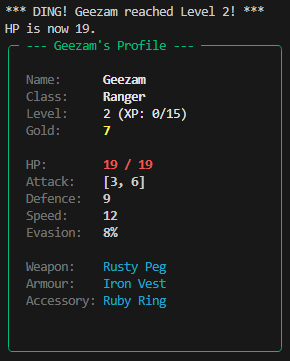
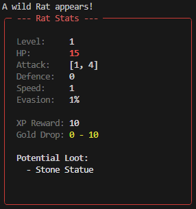
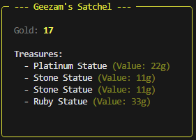

# simple-RPG

Learning Python by creating a simple text-based RPG.

Originally started in June 2016, this project was revisited and completely refactored in November 2025 to use modern Python features like dataclasses, properties, and a modular, multi-file structure.

## Description

A simple text-based RPG with classes for Heroes, Enemies, and Items, and functions for leveling up, battling, equipping items, and calculating stats. The intent is to expand on RPG functionality as a learning process to understand coding with Python.

The project is built to be modular, separating data (classes, items, enemies), logic (functions, spawning), and presentation (a `rich`-based UI) into their own files.

Inspired by classic text-based RPGs like *Sword of Hope* for the Game Boy.

## Features

* **Modular Project Structure:** All data, logic, and UI are decoupled into separate `.py` files (`classes.py`, `functions.py`, `spawn.py`, `ui.py`, `items.py`, `enemies.py`).
* **Rich Console UI:** All game output is handled by a dedicated `ui.py` module that uses the `rich` library to create beautiful, styled panels for profiles, combat logs, and more.
* **Dynamic Stat System:** All Hero stats (`hpMax`, `atk`, `dfn`, `speed`, `evasion`) are calculated on the fly using `@property` methods, allowing equipment to grant real-time bonuses.
* **Item & Equipment System:**
    * Create items (weapons, armor, accessories, treasure) using a dedicated `Item` dataclass.
    * Equip items in `weapon`, `armour`, and `accessory` slots.
    * Accessories can grant bonuses to *any* stat, including HP, Speed, and Evasion.
* **Turn-Based Combat:**
    * **First Strike:** The combatant with the highest `speed` attacks first.
    * **Probabilistic Turns:** After the first strike, turn order is determined by a percentage chance based on the speed of both combatants.
    * **Evasion & Defense:** Attacks must pass an Evasion check (vs. a 1-100 roll) and then must be strong enough to overcome the defender's `dfn` to deal damage.
* **Enemy Spawning Factory:** A `spawn.py` file acts as a "factory" to create enemies from templates, make `deepcopy` copies, and dynamically add unique, randomized loot.
* **Loot & Inventory System:**
    * Defeated enemies drop Gold and `Item` objects (both equipment and "treasure").
    * Loot is added to the Hero's `inventory` list.
    * A dedicated "Satchel" screen in the UI displays all collected Gold and "treasure" items.
* **Leveling:** Gain XP from enemies to level up, which increases your Hero's `base_hpMax`, `base_speed`, and `base_evasion`.

## Screenshots

